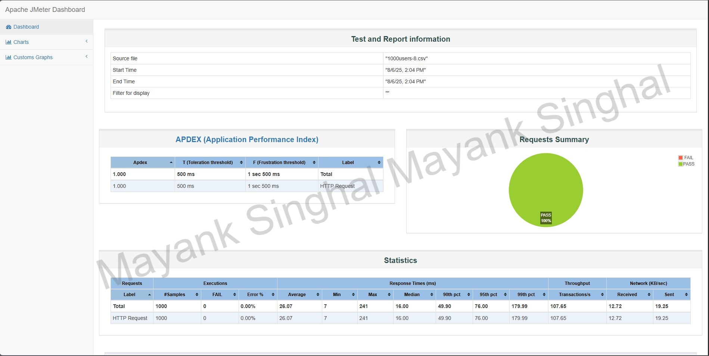

# 🚦 Spring Boot Rate Limiter Library

A **high-performance, extensible, and plug-and-play** Rate Limiting library built with **Spring Boot**, **Redis**, and **Lua scripting**. Designed to be dropped into **enterprise-scale** applications with **multi-tiered** user support (Free, Premium, etc.) and minimal effort.

---

## 🧠 Why This Project?

API Rate Limiting is crucial for:
- Preventing abuse and DoS attacks
- Managing traffic from different users
- Enabling monetization (freemium/premium tiers)
- Guaranteeing fair usage across consumers

---

## ✨ Key Features

| Feature                        | Description                                                                 |
|-------------------------------|-----------------------------------------------------------------------------|
| 🔒 Tier-based Limiting         | Use JWT claims to dynamically assign limits (Free, Premium, etc.)           |
| 🧩 Pluggable Algorithms        | Swap between Fixed Window, Token Bucket, and Sliding Window on the fly     |
| 🔀 Strategy Abstraction        | Choose per-IP, per-User, per-URI, or hybrid key strategies easily           |
| 💡 Lua + Redis for Accuracy   | Uses Lua scripts for atomicity and concurrency safety in Redis              |
| 🧵 Thread-safe Design          | Designed with concurrency and thread safety in mind                         |
| 🚀 Tested at Scale             | 1000+ concurrent users with 1.0 APDEX (JMeter tested)                       |
| 📦 Ready for Packaging         | Can be published as a plug-and-play Java library for use in any project     |
| 🧪 Easy to Extend              | Add your own custom algorithms or key strategies with minimal effort        |

---

## 🛠️ Tech Stack

- **Java 21**
- **Spring Boot**
- **Redis**
- **Lua scripting**
- **JWT (for user tiers)**
- **Apache JMeter** (for performance testing)

---

## 📈 Performance & Testing

Tested using **Apache JMeter** with **1000 concurrent virtual users**, achieving:
- **APDEX Score**: `1.0` (Excellent)
- **First response latency**: ~1.5s (warm-up)
- **Average response latency**: ~30-50ms (post warm-up)

### 🔬 Real Optimizations Implemented

- Replaced in-memory variables with **Redis-backed, distributed-safe** counters.
- Used **Lua scripting** for atomic operations (refill, consume).
- Abstracted algorithms to avoid lock contention and improve **multi-threaded scalability**.
- Resolved **memory leaks** and high GC pressure from naive increment/expire logic.

---

## 🧠 Architectural Highlights

- **Interceptor-based request handling**
- **Dynamic algorithm resolver** per user tier
- **Dynamic key strategy resolver** based on request URI/IP/User
- **RedisTemplate abstraction** for shared counters
- **Lua-based Token Bucket** for concurrency-safe request throttling
- **JWT-based policy resolution** (no DB lookup required)

---

## 🏹 Future Goals

| Priority | Feature                                  | Purpose                                                             |
|----------|------------------------------------------|---------------------------------------------------------------------|
| 🔜       | Publish as a Maven library                | Plug-and-play usage in external projects                           |
| 🔜       | Circuit Breaker fallback on Redis failure| Allow degraded mode with logging when Redis is down                |
| 🔜       | UI Dashboard & Monitoring (Prometheus)    | Real-time usage tracking and alerting                              |
| 🔜       | Distributed setup + Docker/K8s            | Run as a microservice in any cloud-native environment              |
| ✅       | Algorithm & Strategy abstraction           | Already done                                                        |
| ✅       | Lua Scripting integration                 | Already done                                                        |
| ✅       | JMeter performance testing                | Already done                                                        |

---

## 🧪 Learning Outcomes

During this project, I explored and mastered:
- Redis internals for concurrency-safe counters
- Lua scripting in Java
- Designing pluggable libraries
- Performance benchmarking with JMeter
- Thread-safe algorithm design
- Decoding JWT for tier-based logic
- Strategy + Resolver patterns in Spring

---

## 👤 About Me

👨‍💻 Hi! My name is **Mayank Singhal** — A backend engineer focused on real-world, scalable software architecture.  
This project was built with a strong emphasis on:
- Clean architecture
- System performance
- Real-world problems (like traffic abuse, cost control)
- Resilience and observability
 
**Feel free to reach me out on**:
- [Email](mayanksinghal.dev@gmail.com)
- [LinkedIn](https://www.linkedin.com/in/mayanksinghal-dev)
---

## 📢 Want to Try It?

This project will soon be available as a Java library for easy integration.  
Stay tuned for setup guides, docs, and a dedicated GitHub release!

> ❤️ **Star** this repo to follow updates and show your support!
